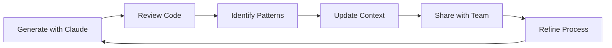

# Team Workflows - Claude Code Coordination Guide

## 📋 Table of Contents
- [Overview](#overview)
- [Branch Assignment Strategy](#branch-assignment-strategy)
- [Claude Context Management](#claude-context-management)
- [Collaboration Patterns](#collaboration-patterns)
- [Code Review Process](#code-review-process)
- [Documentation Standards](#documentation-standards)
- [Team Protocols](#team-protocols)
- [Emergency Procedures](#emergency-procedures)
- [Quality Assurance](#quality-assurance)

---

## Overview

This document establishes team protocols for using Claude Code effectively across the AgentRadar development team. Following these workflows ensures consistent, high-quality code generation while maintaining clear ownership and accountability.

### Core Principles
1. **Context Isolation**: Each branch maintains its own Claude context
2. **Knowledge Sharing**: Team-wide learning from Claude interactions
3. **Quality First**: All Claude-generated code undergoes review
4. **Documentation**: Every Claude session contributes to team knowledge

---

## Branch Assignment Strategy

### Branch Hierarchy & Permissions

```
Repository Structure:
├── main                    [Protected - Senior Developers Only]
├── develop                 [Protected - Team Leads]
├── release/*              [Protected - Release Manager]
├── feature/*              [Individual Developers]
├── hotfix/*               [Emergency Access]
├── experiment/*           [Claude Testing]
└── personal/*             [Developer Sandboxes]
```

### Branch-Specific Claude Rules

#### 🔒 **Main Branch**
**Access:** Senior Developers Only  
**Claude Usage:** Production refinements only  
**Context Files Required:**
- `CLAUDE.md` (production version)
- `COMMANDS.md` (stable commands)
- `SECURITY.md` (security protocols)

```bash
# Main branch Claude session setup
git checkout main
cp .claude/production/CLAUDE.md ./CLAUDE.md
claude-code --context production --safety high
```

#### 🚀 **Develop Branch**
**Access:** Team Leads + Senior Developers  
**Claude Usage:** Integration and testing  
**Context Files Required:**
- `CLAUDE.md` (development version)
- `TESTING.md` (test protocols)
- `INTEGRATION.md` (integration guides)

```bash
# Develop branch Claude session
git checkout develop
cp .claude/development/CLAUDE.md ./CLAUDE.md
claude-code --context development --safety medium
```

#### ✨ **Feature Branches**
**Access:** Individual Developers  
**Claude Usage:** Full feature development  
**Naming Convention:** `feature/{ticket-id}-{description}`

```bash
# Feature branch Claude session
git checkout -b feature/AR-123-white-label-deployment
cp .claude/templates/feature-CLAUDE.md ./CLAUDE.md
# Customize CLAUDE.md for specific feature
claude-code --context feature --scope "white-label deployment"
```

**Feature Branch Claude Context Template:**
```markdown
# Feature: [FEATURE_NAME]
## Ticket: [JIRA/GITHUB_ISSUE]
## Developer: [NAME]
## Claude Session ID: [UNIQUE_ID]

### Feature Requirements
- [ ] Requirement 1
- [ ] Requirement 2

### Technical Constraints
- Must integrate with existing [SYSTEM]
- Performance target: [METRIC]
- Security requirements: [STANDARD]

### Available Commands
[Feature-specific commands from COMMANDS.md]

### Related Documentation
- Link to design docs
- Link to API specs
- Link to test plans
```

#### 🚨 **Hotfix Branches**
**Access:** On-call developers  
**Claude Usage:** Focused fixes only  
**Naming Convention:** `hotfix/{issue-id}-{description}`

```bash
# Hotfix branch Claude session
git checkout -b hotfix/AR-911-critical-scraper-fix
cp .claude/emergency/hotfix-CLAUDE.md ./CLAUDE.md
claude-code --context hotfix --priority critical --scope narrow
```

#### 🧪 **Experiment Branches**
**Access:** All developers  
**Claude Usage:** Testing Claude capabilities  
**Naming Convention:** `experiment/{developer}-{concept}`

```bash
# Experiment branch - for testing Claude approaches
git checkout -b experiment/john-ai-scraper-optimization
cp .claude/templates/experiment-CLAUDE.md ./CLAUDE.md
claude-code --context experiment --safety low --verbose
```

---

## Claude Context Management

### Context File Structure

```
.claude/
├── production/
│   ├── CLAUDE.md          # Production-safe instructions
│   ├── COMMANDS.md         # Stable command library
│   └── SECURITY.md         # Security protocols
├── development/
│   ├── CLAUDE.md          # Development instructions
│   ├── COMMANDS.md        # Dev + experimental commands
│   └── TESTING.md         # Testing protocols
├── templates/
│   ├── feature-CLAUDE.md  # Feature branch template
│   ├── hotfix-CLAUDE.md   # Hotfix template
│   └── experiment-CLAUDE.md # Experiment template
├── shared/
│   ├── ARCHITECTURE.md   # System architecture
│   ├── DATABASE.md        # Database schemas
│   └── API.md            # API documentation
└── sessions/
    └── [timestamp]-[developer]-[branch].log
```

### Context Synchronization Protocol

```bash
# Daily context sync (run by CI/CD)
npm run claude:sync

# This script:
# 1. Collects all CLAUDE.md updates from feature branches
# 2. Identifies new commands and patterns
# 3. Updates shared knowledge base
# 4. Distributes updates to team
```

### Session Management

```javascript
// .claude/session-manager.js
class ClaudeSessionManager {
  constructor(developer, branch, ticket) {
    this.sessionId = this.generateSessionId();
    this.context = {
      developer,
      branch,
      ticket,
      startTime: new Date().toISOString(),
      commands: [],
      files: [],
      insights: []
    };
  }

  startSession() {
    console.log(`
╔══════════════════════════════════════════════════════╗
║           Claude Code Session Started                 ║
╠══════════════════════════════════════════════════════╣
║ Developer: ${this.context.developer.padEnd(43)}║
║ Branch: ${this.context.branch.padEnd(46)}║
║ Ticket: ${this.context.ticket.padEnd(46)}║
║ Session: ${this.sessionId.padEnd(45)}║
╚══════════════════════════════════════════════════════╝
    `);
    
    this.loadContextFiles();
    this.recordSession();
  }

  loadContextFiles() {
    // Load appropriate CLAUDE.md based on branch type
    const branchType = this.context.branch.split('/')[0];
    const contextPath = `.claude/${this.getContextPath(branchType)}`;
    // Copy context files to working directory
  }

  recordSession() {
    // Log all commands and interactions
    const logPath = `.claude/sessions/${this.sessionId}.log`;
    // Stream session to log file
  }

  generateSessionId() {
    const timestamp = new Date().toISOString().replace(/[:.]/g, '-');
    return `${timestamp}-${this.context.developer}-${this.context.branch.replace(/\//g, '-')}`;
  }
}
```

---

## Collaboration Patterns

### 1. Knowledge Sharing Protocol

#### Daily Claude Insights Meeting (15 min standup addition)
```markdown
## Claude Insights Share
- **Developer:** [Name]
- **Discovery:** [What Claude helped solve]
- **New Pattern:** [Reusable pattern discovered]
- **Command Added:** [New command for COMMANDS.md]
- **Gotcha:** [Any issues or limitations found]
```

#### Weekly Claude Review Session
```markdown
## Weekly Claude Code Review
- Review all Claude-generated code from the week
- Identify patterns for team library
- Update CLAUDE.md with new learnings
- Refine command library
- Share efficiency gains
```

### 2. Shared Command Library Management

```bash
# Commands are versioned and tagged
.claude/commands/
├── v1.0.0/
│   ├── core-commands.md      # Stable, tested commands
│   ├── scraper-commands.md    # Domain-specific
│   └── deployment-commands.md # Infrastructure
├── v1.1.0-beta/
│   ├── experimental-commands.md # Under testing
│   └── ai-enhanced-commands.md  # Claude-optimized
└── contributions/
    ├── [developer]-[date]-[feature].md
    └── pending-review/
```

### 3. Claude Context Inheritance

```yaml
# .claude-inheritance.yaml
inheritance:
  base: .claude/shared/CLAUDE.md
  
  branches:
    main:
      inherits: [base]
      adds: [production-safety, deployment-protocols]
    
    develop:
      inherits: [base]
      adds: [testing-commands, integration-tests]
    
    feature/*:
      inherits: [base, develop]
      adds: [feature-specific]
      developer-custom: allowed
    
    hotfix/*:
      inherits: [main]
      adds: [emergency-protocols]
      restrictions: [no-schema-changes, no-new-dependencies]
```

### 4. Cross-Team Claude Sessions

```bash
# Pair programming with Claude
npm run claude:pair-session \
  --developers "alice,bob" \
  --branch "feature/complex-integration" \
  --context "shared" \
  --record-insights

# Mob programming with Claude
npm run claude:mob-session \
  --team "platform-team" \
  --objective "architect white-label system" \
  --duration "2h" \
  --output "architecture-decisions.md"
```

---

## Code Review Process

### Claude-Generated Code Review Checklist

```markdown
## PR Review Checklist for Claude-Generated Code

### 1. Claude Context Verification
- [ ] CLAUDE.md file included and appropriate for branch
- [ ] Session ID included in PR description
- [ ] Commands used are documented

### 2. Code Quality Checks
- [ ] **Correctness**: Does the code solve the intended problem?
- [ ] **Completeness**: Are all edge cases handled?
- [ ] **Consistency**: Does it follow project patterns?
- [ ] **Comments**: Are Claude's assumptions documented?
- [ ] **Tests**: Are tests included and comprehensive?

### 3. Security Review
- [ ] No hardcoded credentials
- [ ] Input validation present
- [ ] SQL injection prevention
- [ ] XSS protection implemented
- [ ] Authentication/authorization correct

### 4. Performance Considerations
- [ ] Database queries optimized
- [ ] No N+1 query problems
- [ ] Appropriate caching implemented
- [ ] Bundle size impact assessed

### 5. Claude-Specific Checks
- [ ] No hallucinated imports or APIs
- [ ] External dependencies are real and maintained
- [ ] Generated patterns match team standards
- [ ] No over-engineering for simple problems

### 6. Documentation
- [ ] README updated if needed
- [ ] API documentation current
- [ ] New commands added to COMMANDS.md
- [ ] Claude learnings documented
```

### PR Template for Claude-Generated Code

```markdown
## Pull Request: [Title]

### Claude Session Information
- **Session ID**: [From session manager]
- **Context Files**: [CLAUDE.md version used]
- **Branch Type**: [feature/hotfix/experiment]
- **Commands Used**: 
  ```bash
  npm run feature:create white-label
  npm run test:integration
  ```

### What Claude Generated
- [ ] New feature implementation
- [ ] Bug fix
- [ ] Refactoring
- [ ] Documentation
- [ ] Tests

### Human Modifications
- List any changes made to Claude's output
- Explain why modifications were necessary

### Testing Performed
- [ ] Unit tests pass
- [ ] Integration tests pass
- [ ] Manual testing completed
- [ ] Performance benchmarked

### Claude Insights
- **Efficiency Gain**: [Time saved]
- **New Patterns**: [Reusable patterns discovered]
- **Limitations Hit**: [Any Claude limitations encountered]

### Reviewers
- @senior-dev - Architecture review
- @team-lead - Business logic review
- @qa-engineer - Test coverage review
```

### Code Review Automation

```javascript
// .github/workflows/claude-code-review.yml
name: Claude Code Review Automation

on:
  pull_request:
    types: [opened, synchronize]

jobs:
  claude-review:
    runs-on: ubuntu-latest
    steps:
      - name: Check Claude Context
        run: |
          # Verify CLAUDE.md exists and is valid
          if [ ! -f "CLAUDE.md" ]; then
            echo "::error::CLAUDE.md context file missing"
            exit 1
          fi
          
      - name: Validate Claude Commands
        run: |
          # Ensure all commands used are documented
          npm run validate:claude-commands
          
      - name: Security Scan
        run: |
          # Extra scrutiny for Claude-generated code
          npm run security:scan:deep
          
      - name: Pattern Check
        run: |
          # Verify patterns match team standards
          npm run lint:patterns
          
      - name: Complexity Analysis
        run: |
          # Check for over-engineering
          npm run analyze:complexity
          
      - name: Generate Review Report
        run: |
          npm run claude:review:report
```

---

## Documentation Standards

### 1. Claude Learning Documentation

```markdown
# Claude Learnings - [Date]

## Session: [Session ID]
**Developer**: [Name]  
**Branch**: [Branch name]  
**Objective**: [What you were trying to achieve]

### What Worked Well
- Technique or prompt that was effective
- Code pattern that Claude generated efficiently
- Time saved compared to manual coding

### Challenges Encountered
- Limitations discovered
- Workarounds needed
- Manual corrections required

### New Commands Discovered
```bash
# Command that worked well
npm run [command]
```

### Patterns to Add to Library
```javascript
// Reusable pattern Claude generated
```

### Recommendations for Team
- Prompting techniques
- Context setup improvements
- Command combinations that work well
```

### 2. CLAUDE.md Versioning

```bash
# CLAUDE.md version control
.claude/versions/
├── CLAUDE.md.v1.0.0       # Initial version
├── CLAUDE.md.v1.1.0       # Added white-label commands
├── CLAUDE.md.v1.2.0       # Enhanced scraper context
├── CHANGELOG.md           # Document all changes
└── migration-guide.md     # How to update between versions
```

### 3. Command Documentation Standards

```markdown
## Command: [Command Name]

### Purpose
Brief description of what the command does

### Usage
```bash
npm run command:name [parameters]
```

### Parameters
- `param1`: Description (required/optional)
- `param2`: Description (required/optional)

### Examples
```bash
# Example 1: Basic usage
npm run command:name value1 value2

# Example 2: Advanced usage
npm run command:name --option value
```

### Claude Optimization
- Best used in [context]
- Combines well with [other commands]
- Claude understands this as [explanation]

### Gotchas
- Warning or limitation
- Common error and solution

### Added By
- Developer: [Name]
- Date: [Date]
- Session: [Session ID]
```

---

## Team Protocols

### 1. Daily Workflow

```bash
# Morning setup (9:00 AM)
npm run team:daily:sync          # Sync all Claude contexts
npm run team:daily:status        # Check CI/CD and branches

# Before starting work
npm run claude:session:start     # Initialize Claude session
npm run context:verify           # Verify correct context loaded

# During development
npm run claude:checkpoint        # Save Claude context state
npm run insights:capture         # Document learnings

# End of day
npm run claude:session:end       # Close and save session
npm run insights:submit          # Submit learnings to team pool
```

### 2. Weekly Team Rituals

#### Monday: Context Planning
```bash
npm run team:weekly:plan
# - Review upcoming features
# - Assign Claude contexts
# - Distribute branch ownership
```

#### Wednesday: Claude Knowledge Share
```bash
npm run team:weekly:insights
# - Share discoveries
# - Demo new patterns
# - Update command library
```

#### Friday: Context Cleanup
```bash
npm run team:weekly:cleanup
# - Archive old sessions
# - Merge learned patterns
# - Update documentation
```

### 3. Role-Specific Protocols

#### Senior Developers
- Review all Claude-generated architecture
- Approve changes to core CLAUDE.md
- Mentor juniors on Claude usage
- Own production Claude contexts

#### Team Leads
- Coordinate Claude context distribution
- Review team insights weekly
- Manage command library evolution
- Approve experimental branches

#### Junior Developers
- Work primarily in feature branches
- Document all Claude interactions
- Share learnings actively
- Request review for complex prompts

#### QA Engineers
- Test Claude-generated code rigorously
- Document test patterns for Claude
- Maintain testing command library
- Verify Claude assumptions

---

## Emergency Procedures

### 1. Production Hotfix with Claude

```bash
#!/bin/bash
# Emergency Claude hotfix protocol

# 1. Create hotfix branch
git checkout -b hotfix/critical-issue-$(date +%s)

# 2. Load emergency context
cp .claude/emergency/HOTFIX-CLAUDE.md ./CLAUDE.md

# 3. Start focused Claude session
npm run claude:emergency \
  --scope "specific issue only" \
  --safety "maximum" \
  --review "required"

# 4. Generate fix
npm run claude:fix:generate

# 5. Test immediately
npm run test:emergency

# 6. Deploy with monitoring
npm run deploy:hotfix:monitored
```

### 2. Claude Rollback Procedures

```bash
# If Claude-generated code causes issues

# Immediate rollback
npm run rollback:immediate

# Analyze what went wrong
npm run claude:analyze:failure

# Document lessons learned
npm run claude:postmortem

# Update safety protocols
npm run claude:safety:update
```

### 3. Context Corruption Recovery

```bash
# If Claude context becomes corrupted

# Reset to last known good state
npm run claude:context:reset

# Rebuild from base
npm run claude:context:rebuild

# Verify integrity
npm run claude:context:verify

# Resume development
npm run claude:session:resume
```

---

## Quality Assurance

### 1. Claude Code Quality Metrics

```javascript
// Track Claude code quality over time
const metrics = {
  efficiency: {
    linesGenerated: 0,
    timesSaved: 0,
    bugsIntroduced: 0,
    bugsFixed: 0
  },
  
  patterns: {
    reusableComponentsCreated: 0,
    commandsAdded: 0,
    documentationGenerated: 0
  },
  
  learning: {
    insightsShared: 0,
    contextImprovements: 0,
    promptOptimizations: 0
  }
};
```

### 2. Continuous Improvement Process



### 3. Team Performance Dashboard

```bash
# Generate team Claude usage report
npm run team:dashboard:generate

# Metrics tracked:
# - Code generation efficiency by developer
# - Most used commands by team
# - Context evolution over time
# - Quality improvements from Claude usage
# - Time saved calculations
# - Knowledge sharing participation
```

---

## Appendices

### A. Quick Reference Card

```bash
# Essential Commands for Daily Use
npm run claude:start            # Start Claude session
npm run claude:checkpoint       # Save progress
npm run claude:share           # Share insights
npm run claude:review          # Review generated code
npm run claude:end             # End session properly
```

### B. Troubleshooting Guide

| Issue | Solution | Command |
|-------|----------|---------|
| Context not loading | Reset context | `npm run claude:context:reset` |
| Commands not working | Validate commands | `npm run commands:validate` |
| Session not recording | Check permissions | `npm run session:debug` |
| Insights not saving | Check disk space | `npm run storage:check` |

### C. Team Resources

- **Claude Best Practices**: `/docs/claude-best-practices.md`
- **Prompt Library**: `/docs/prompt-library.md`
- **Pattern Catalog**: `/docs/pattern-catalog.md`
- **Video Tutorials**: `/docs/tutorials/`
- **Team Chat**: `#claude-code-team`

---

*This document is a living guide. Update it as the team discovers new patterns and best practices for working with Claude Code.*

*Last Updated: [Date]  
Version: 1.0.0  
Maintainer: [Team Lead Name]*
